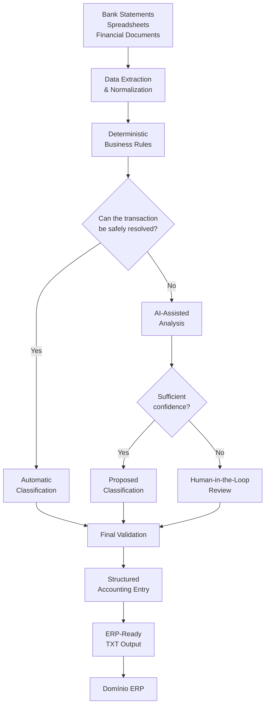
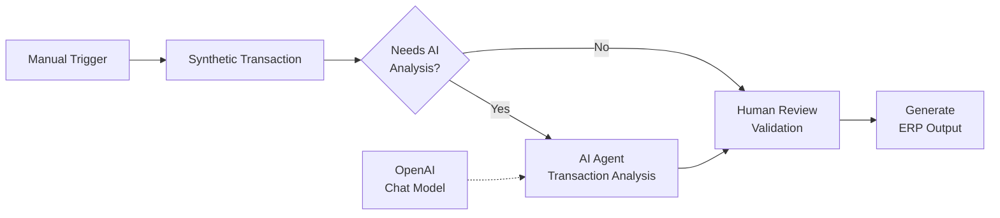

# AI-Powered Accounting Automation

> **Applied AI and workflow automation for real-world accounting operations using n8n, Generative AI, deterministic business rules and human-in-the-loop validation.**


---

## Overview

This project was created to reduce the manual effort involved in accounting reconciliation, financial transaction analysis and accounting entry preparation.

The workflow processes information from sources such as **bank statements, spreadsheets and accounting documents**, applies deterministic business rules, uses AI-assisted analysis when contextual interpretation is necessary, identifies exceptions that require human review and prepares structured accounting entries for ERP import.

The solution is currently applied to processes involving **15 companies in a real accounting environment**.

This public repository is a **sanitized portfolio representation** of the production project.

---

## Real-World Impact

| Metric | Result |
|---|---|
| Processes automated | **15 companies** |
| Previous execution time | **6+ hours of manual work** |
| Automated execution time | **~10 minutes** |
| Main automation platform | **n8n** |
| AI approach | **Generative AI + AI Agents** |
| Validation strategy | **Deterministic rules + Human-in-the-loop** |
| ERP destination | **Domínio ERP** |

The objective is not only to increase speed.

The project is also designed to:

- reduce repetitive manual work;
- improve processing consistency;
- identify exceptions before ERP import;
- avoid forcing uncertain classifications;
- preserve human validation for sensitive cases;
- improve operational reliability;
- create a more traceable accounting workflow.

---

# Workflow Preview

The screenshot below shows a **synthetic n8n workflow created specifically for this public portfolio**.

It demonstrates the same architectural concepts used in the project without exposing production workflows, confidential accounting rules or client information.

<!-- ARRASTE A IMAGEM n8n-accounting-workflow-demo-final.png AQUI -->


---

## High-Level Architecture



---

## n8n Automation Logic

A simplified portfolio representation of the workflow:



Conceptually:

```text
Manual Trigger
      ↓
Synthetic Financial Transaction
      ↓
Deterministic Analysis
      ↓
Needs AI Analysis?
     ↙            ↘
   Yes             No
    ↓               ↓
AI-Assisted      Direct
 Analysis       Validation
    ↓               ↓
Human Review when required
          ↓
    Final Validation
          ↓
 Structured Accounting Entry
          ↓
      ERP TXT Output
          ↓
       Domínio ERP
```

---

# Core Capabilities

## Financial Processing

- Bank statement processing
- Spreadsheet organization
- Financial data normalization
- Transaction analysis
- Accounting reconciliation support
- Structured accounting entry preparation

## Automation

- n8n workflow orchestration
- Business process automation
- Multi-step workflows
- Conditional routing
- Exception handling
- Human approval stages
- Structured output generation

## Artificial Intelligence

- Generative AI
- AI Agents
- Prompt Engineering
- AI-assisted transaction analysis
- Contextual classification
- Exception analysis
- Human-in-the-loop workflows

## Validation

- Deterministic business rules
- Validation before output
- Pending-item detection
- Separation of uncertain cases
- Human review for exceptions
- Prevention of unsafe automatic decisions

---

# Architecture Principles

## 1. Deterministic First

When a transaction can be safely processed using explicit accounting or business rules, deterministic logic is preferred.

```text
Known rule → deterministic processing
Uncertain situation → additional analysis
```

AI is not used simply because it is available.

It is used where contextual interpretation can add value.

---

## 2. AI-Assisted, Not AI-Only

Generative AI assists with situations where rigid rules alone are insufficient.

The architecture avoids treating AI output as automatically correct.

AI suggestions can still pass through validation or human review before becoming an accounting entry.

---

## 3. Human-in-the-Loop

Cases that cannot be classified safely are separated for human validation.

```text
Low confidence
      ↓
Exception detected
      ↓
Human review
      ↓
Validation
      ↓
Continue processing
```

This is particularly important in financial and accounting workflows where an incorrect automatic classification can create downstream errors.

---

## 4. Validation Before ERP Output

The workflow is designed so that validation occurs **before** the final ERP-ready file is generated.

```text
Processing
    ↓
Classification
    ↓
Validation
    ↓
ERP Output
```

The ERP output is the end of the workflow, not the beginning of the validation process.

---

## 5. Fail-Safe Behavior

When the system does not have enough information to make a safe decision, the preferred behavior is to **stop, flag or route the transaction for review** instead of forcing a classification.

```text
Uncertain ≠ Automatically Accepted
```

---

## 6. Iterative Development

The automation has evolved through multiple workflow versions.

Improvements focus on:

- reliability;
- validation;
- exception handling;
- error reduction;
- workflow clarity;
- operational safety;
- maintainability.

---

# Technology Stack

## Automation

**n8n**

Used as the main workflow orchestration platform.

Applications include:

- process orchestration;
- conditional logic;
- data transformation;
- AI integration;
- validation flows;
- human approval;
- structured output generation.

---

## Artificial Intelligence

### ChatGPT / OpenAI

Used for AI-assisted analysis, reasoning support and workflow development.

### Claude / Claude Code

Used as an AI-assisted development environment for workflow analysis, technical improvements and project evolution.

### OpenAI Codex

Used for AI-assisted development, validation and technical project work.

### AI Agents

Used to create workflows capable of handling contextual tasks while remaining integrated with deterministic business logic.

---

## Business Environment

- Accounting operations
- Bank statements
- Financial spreadsheets
- Reconciliation processes
- Accounting entries
- **Domínio ERP**

---

# Synthetic End-to-End Example

The following example is **completely fictional** and exists only to demonstrate the workflow.

## 1. Input

A transaction is received from a fictional bank statement:

```text
Date: 15/07/2026
Description: PIX RECEIVED - DEMO CLIENT LTDA
Amount: BRL 1,250.00
Type: Credit
```

---

## 2. Data Normalization

The workflow converts the source information into a structured representation:

```text
date: 15/07/2026
description: PIX RECEIVED - DEMO CLIENT LTDA
amount: 1250.00
transaction_type: credit
source: synthetic_portfolio_demo
```

---

## 3. Rule Analysis

The system checks whether deterministic rules contain enough information to safely resolve the transaction.

```text
Transaction detected
        ↓
Check business rules
        ↓
Known classification?
```

If the classification is known, the workflow continues automatically.

If not, additional analysis is triggered.

---

## 4. AI-Assisted Analysis

For an uncertain transaction, an AI agent may analyze contextual information and propose a classification.

Example:

```text
Suggested Classification: Customer Receipt
Confidence: High
Human Review Recommended: No
```

AI output remains subject to workflow validation.

---

## 5. Structured Result

```text
Transaction: PIX RECEIVED
Classification: Customer Receipt
Status: Validated
Human Review: Not Required
Output: Ready for ERP import
```

---

## 6. ERP-Ready Output

Illustrative TXT output:

```text
15/07/2026;DEBIT_ACCOUNT;CREDIT_ACCOUNT;1250,00;HISTORY_CODE;DEMO CLIENT RECEIPT;COMPANY_CODE
```

The production output follows the accounting import structure required by the ERP workflow.

> All account numbers, company codes, names and transaction details shown above are fictional placeholders.

---

# Why This Project Exists

Accounting teams frequently spend significant time performing repetitive tasks such as:

```text
Reading statements
      ↓
Identifying transactions
      ↓
Comparing spreadsheets
      ↓
Checking accounting information
      ↓
Classifying transactions
      ↓
Finding pending items
      ↓
Preparing accounting entries
      ↓
Importing information into the ERP
```

The purpose of this project is to reduce the repetitive portion of this workflow while keeping **human judgment available where it is actually necessary**.

The goal is therefore not:

> "Replace accounting professionals with AI."

The goal is:

> **Use automation and AI to remove repetitive operational work while preserving validation and control.**

---

# Project Evolution

The project started from the need to automate repetitive accounting routines and has evolved through continuous improvements.

The development process involves:

```text
Real accounting problem
        ↓
Workflow design
        ↓
Automation implementation
        ↓
Testing with real operational scenarios
        ↓
Identification of exceptions
        ↓
Workflow improvement
        ↓
New validation rules
        ↓
Production use
        ↓
Continuous improvement
```

Instead of treating the automation as a one-time script, the project is developed as an evolving operational system.

---

# Public Portfolio vs Production System

This repository **does not contain the complete production system**.

```text
Production System
      ↓
Private environment
      ↓
Real operational workflows
      ↓
Real accounting data
```

```text
Public GitHub Repository
      ↓
Architecture explanation
      ↓
Synthetic examples
      ↓
Portfolio demonstrations
```

This separation is intentional.

---

# Privacy & Security

This repository is a **portfolio representation of the project**.

Production workflows, client files and confidential accounting information are intentionally not published.

No real client data is included in this public repository, including:

- names;
- CNPJs;
- bank statements;
- transactions;
- bank information;
- accounting documents;
- credentials;
- authentication tokens;
- ERP credentials;
- internal accounting rules;
- private business logic;
- confidential company information.

Any examples published here use **synthetic or anonymized data**.

No production credentials or secrets are stored in this repository.

---

# Project Status

### 🟢 Active Development

The automation is already used in real accounting processes.

The system continues to evolve as new operational scenarios, validations and automation opportunities are identified.

---

# Results

### 15 companies

Automation has already been applied to processes involving **15 companies**.

### 6+ hours → ~10 minutes

Processes that previously required **more than six hours of manual work** can now be completed in approximately **10 minutes** using the automated workflow.

### Real business environment

This is not only a classroom or tutorial project.

The automation was developed around **real operational problems inside an accounting firm**.

---

# What I Learned Building This Project

Building the automation has provided practical experience with:

- workflow design;
- n8n;
- AI agents;
- Generative AI;
- prompt engineering;
- business process automation;
- exception handling;
- human-in-the-loop validation;
- financial data processing;
- spreadsheet organization;
- iterative development;
- AI-assisted development;
- translating business problems into automation workflows.

---

# About Me

I'm **Théo Moron**, based in Indaiatuba, São Paulo, Brazil.

I work with **Applied AI and process automation inside an accounting firm**, developing practical solutions aimed at reducing repetitive operational work.

My primary areas of interest are:

- AI Automation
- n8n
- AI Agents
- Generative AI
- Applied AI
- Business Process Automation

I enjoy using AI not only as a conversational tool, but as a component inside workflows designed to solve **real business problems**.

---

# Current Technical Development

I am currently deepening my knowledge of:

- REST APIs
- JSON
- Git & GitHub
- integration concepts
- programming fundamentals

My next major programming focus is **Python**.

I am also completing the **Agentes de IA e n8n Impressionador** course from **Hashtag Treinamentos**, focused on practical automation and AI agent development with n8n.

---

# Career Focus

I'm interested in **remote opportunities** involving:

**AI Automation · AI Agents · Generative AI · Applied AI · n8n Automation · Intelligent Automation**

---

# Connect With Me

**LinkedIn**  
[linkedin.com/in/theo-moron-07904642b](https://www.linkedin.com/in/theo-moron-07904642b)

**GitHub**  
[github.com/TheoMAS23](https://github.com/TheoMAS23)

**Email**  
theomoron.anastaciosilva@gmail.com

---

> Built from a real business need and continuously improved through practical use.
