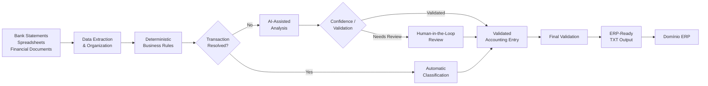

# AI-Powered Accounting Automation

> AI and workflow automation for real-world accounting operations using **n8n, Generative AI and human-in-the-loop validation**.

## Overview

This project was created to reduce the manual effort involved in accounting reconciliation and transaction preparation.

It processes financial information from sources such as bank statements, spreadsheets and accounting documents, applies business rules and AI-assisted analysis, identifies exceptions that require human review, and prepares structured accounting entries for ERP import.

The solution is currently applied to processes involving **15 companies** in a real accounting environment.

## Impact

**Before:** 6+ hours of manual work
**After:** approximately 10 minutes with automation

The main goal is not only speed, but also:

* reducing repetitive manual work;
* improving consistency;
* identifying exceptions before ERP import;
* preserving human validation for uncertain cases;
* creating a more auditable accounting workflow.

## Main Workflow

```text
Financial Documents
        ↓
Data Extraction & Organization
        ↓
Deterministic Business Rules
        ↓
AI-Assisted Analysis
        ↓
Validation & Exception Detection
        ↓
Human Review when required
        ↓
Accounting Entry Generation
        ↓
ERP-Ready TXT Output
```


## Core Features

* Bank statement processing
* Spreadsheet and financial data organization
* Transaction classification
* Accounting reconciliation support
* Business-rule-based processing
* AI-assisted classification
* Exception and pending-item detection
* Human-in-the-loop approval
* Validation before output generation
* Structured accounting entry generation
* ERP-ready TXT output
* Continuous workflow testing and improvement

## AI & Automation Stack

### Automation

* **n8n**
* Workflow orchestration
* No-code / low-code automation

### Artificial Intelligence

* Generative AI
* AI Agents
* Prompt Engineering
* ChatGPT
* Claude / Claude Code
* OpenAI Codex

### Business Environment

* Financial spreadsheets
* Bank statements
* Accounting reconciliation
* **Domínio ERP**

## Architecture Principles

The project follows several principles designed for real business operations:

### Deterministic First

Whenever an accounting decision can be safely resolved through explicit business rules, deterministic logic is preferred.

AI is used primarily for cases where interpretation or contextual analysis is necessary.

### Human-in-the-Loop

Uncertain or exceptional situations are separated for human validation rather than automatically accepted.

### Validation Before Output

Entries are validated before generating the final ERP-ready file.

### Iterative Development

The system has evolved through multiple workflow versions, with improvements focused on:

* reliability;
* validation;
* exception handling;
* error reduction;
* workflow traceability.

## Example Processing Flow

```text
Bank Statement / Spreadsheet
            ↓
      Data Processing
            ↓
    Transaction Analysis
       ↙           ↘
Known Rule      Uncertain Case
    ↓                ↓
Automatic      AI Analysis /
Classification Human Review
       ↘           ↙
         Validation
             ↓
    Accounting Entries
             ↓
       ERP TXT File
```

## Synthetic Example

The example below uses completely fictional data and is intended only to demonstrate the workflow.

### 1. Input

A financial transaction is received from a bank statement:

```text
Date: 15/07/2026
Description: PIX RECEIVED - DEMO CLIENT LTDA
Amount: BRL 1,250.00
Type: Credit
```

### 2. Processing

The workflow:

1. Extracts and normalizes the transaction data.
2. Checks deterministic accounting and business rules.
3. Searches for sufficient information to classify the transaction.
4. Routes uncertain situations for AI-assisted analysis or human review.
5. Validates the accounting entry before generating the final output.

### 3. Structured Result

```text
Transaction: PIX RECEIVED
Classification: Customer Receipt
Status: Validated
Human Review: Not Required
Output: Ready for ERP import
```

### 4. ERP-Ready Output

Illustrative TXT output:

```text
15/07/2026;DEBIT_ACCOUNT;CREDIT_ACCOUNT;1250,00;HISTORY_CODE;DEMO CLIENT RECEIPT;COMPANY_CODE
```

> Account numbers, company codes and transaction details in this example are fictional placeholders. Production accounting rules and client information are not published.

## Privacy & Security
